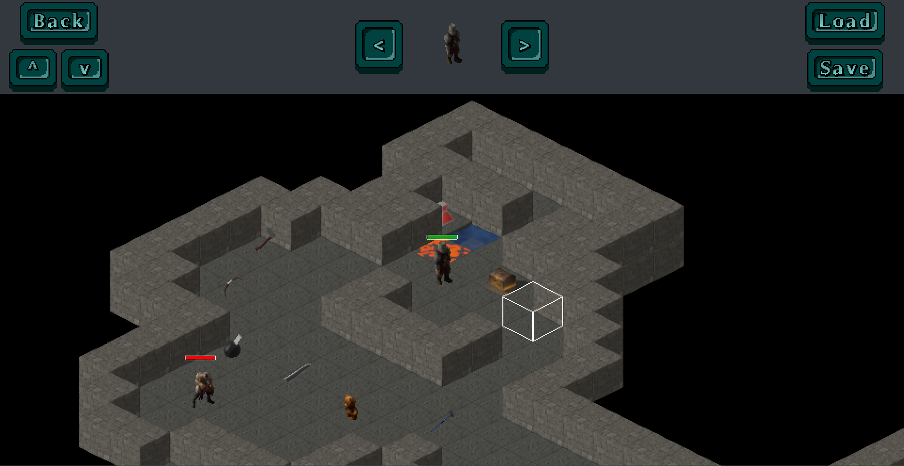

<div align="center">


</div>

## 
<!-- image du jeu en mode editeur -->
<div align="center">




</div>

[](https://youtu.be/_lqwWWd5G5U)
[](https://github.com/toxicbloud/ACL-2023-MazeOfMadness/actions)

## Sommaire
- [Elevator Speech](#elevator-speech)
- [Présentation détaillée du Jeu](#description-du-jeu)
  - [Description du Jeu](#description-du-jeu)
  - [Caractéristiques Principales](#caractéristiques-principales)
  - [Objectif du Projet](#objectif-du-projet)
  - [Valeurs Clés](#valeurs-clés)
- [Auteurs](#auteurs)
- [Installation](#installation)
  - [Prérequis](#prérequis)
  - [Étapes d'Installation](#étapes-dinstallation)

## Elevator speech
Plongez dans un monde isométrique plein de mystère et de danger avec **Maze of Madness**. Explorez des labyrinthes complexes et survivez à des monstres aux comportements uniques. En mode campagne, découvrez une histoire épique à travers une série de labyrinthes intrigants, créés par les développeurs ou la communauté via l'éditeur de carte. Défiez l'infini en mode libre avec des labyrinthes générés aléatoirement. Collectez des objets, découvrez des armes et affrontez l'inconnu. **Maze of Madness** offre une expérience isométrique, une rejouabilité infinie et une communauté passionnée. Êtes-vous prêt à relever le défi ?

## Description du Jeu
MoM est un jeu vidéo isométrique immersif qui propose aux joueurs une expérience captivante de labyrinthes complexes, d'exploration et de survie. Le jeu offre deux modes de jeu distincts :

1. **Mode Campagne :** Les joueurs se lancent dans une aventure épique à travers une série de labyrinthes prédéfinis.

2. **Mode Libre :** Pour ceux qui recherchent un défi sans fin, le mode libre génère des labyrinthes aléatoires à explorer à l'infini. Chaque labyrinthe est unique, offrant une expérience de jeu différente à chaque session. Les joueurs peuvent tester leurs compétences de survie.

Il s'adresse donc aux joueurs occasionnels voulant battre la campagne mais aussi aux joueurs souhaitant affronter en boucle des monstres de plus en plus forts.

## Caractéristiques Principales

- **Gameplay Isométrique :** L'utilisation de la perspective isométrique permet de surplomber l'environnement afin d'appréhender le danger.

- **Variété de Monstres avec Comportements Uniques :** Les monstres du jeu ont des comportements distincts. Par exemple, les fantômes peuvent traverser les murs pour surprendre les joueurs qui ne les regardent pas, tandis que les zombies avancent vers le joueur une fois qu'ils l'ont détectés.

- **Éditeur de Niveaux Communautaires :** Les joueurs peuvent créer et partager leurs propres labyrinthes avec la communauté, ajoutant ainsi une dimension de rejouabilité infinie.

- **Collecte d'Objets :** Les joueurs peuvent collecter des objets utiles tels que des potions de santé et de force pour survivre aux attaques des monstres. De plus, ils peuvent découvrir et s'équiper de différentes armes pour se défendre.

- **Prise en Charge de la Manette :** Le jeu est conçu pour être accessible aux joueurs qui préfèrent jouer avec une manette, offrant une expérience de jeu fluide et intuitive mais surtout accessible.

## Objectif du Projet
L'objectif ultime de ce projet est de créer une expérience de jeu isométrique captivante qui défie les joueurs avec des labyrinthes complexes ainsi qu'une variété de monstres. Le jeu vise à offrir une rejouabilité infinie grâce à ses labyrinthes générés aléatoirement et à son éditeur de niveaux communautaires.

## Valeurs Clés
L'exploration, la survie, la créativité communautaire et l'accessibilité sont les valeurs clés de ce jeu. Nous visons à créer une communauté de joueurs passionnés qui partagent leurs propres créations et défient constamment leurs compétences.

# Auteurs

Antonin Rousseau |                                                                             | Paul Loisil |                                                         |
---------------- | --------------------------------------------------------------------------- | ----------- | ------------------------------------------------------- |
Site web         | [antoninrousseau.fr](https://antoninrousseau.fr)                            | Site web    | [furwaz.fr](https://furwaz.fr)                          |
GitHub           | [@toxicbloud](https://github.com/toxicbloud)                                | GitHub      | [@furwaz](https://github.com/furwaz)                    |
LinkedIn         | [Antonin Rousseau](https://www.linkedin.com/in/antonin-rousseau-571280159/) | LinkedIn    | [Paul LOISIL](https://www.linkedin.com/in/loisil-paul/) |

| Maxime Marcelin |                                                                           | Clément Joly |     |
| --------------- | ------------------------------------------------------------------------- | ------------ | --- |
| Site web        |                                                                           | Site web     |     |
| GitHub          | [@Maximelego](https://github.com/Maximelego)                              | GitHub       |     |
| LinkedIn        | [Maxime Marcelin](https://www.linkedin.com/in/maxime-marcelin-a7b53225a/) | LinkedIn     |     |

# Installation

## Prérequis
<div align="center">

 &nbsp;&nbsp;&nbsp;&nbsp;  &nbsp;&nbsp;&nbsp;&nbsp; 

</div>

## Étapes d'Installation

1. **Cloner le Projet (Si vous utilisez Git)**
```bash
   git clone https://github.com/toxicbloud/ACL-2023-MazeOfMadness
```
2. **Déplacer vous dans le dossier du projet**
> le projet Maze Of Madness est abrégé en mom
```bash
   cd ACL-2023-MazeOfMadness/mom
```
3. **Compiler le projet**
```bash
   mvn clean package
```
> Cela téléchargera les dépendances, compilera le code source et générera des fichier JAR dans le répertoire target du projet.
4. **Lancer le jeu**
```bash
    java -jar target/<nom_du_jar>.jar
```
> Le nom du jar est normalement MazeOfMadness-jar-with-dependencies.jar

> [!IMPORTANT]
> Pour MacOS il faut ajouter l'option `-XstartOnFirstThread` pour lancer le jeu
 

Merci à [@Nicoooooo](https://github.com/Nicoooooo) pour cette astuce sur MacOS

# Utilisation

## Contrôles : 
| Touche           | Action                     |
| ---------------- | -------------------------- |
| **Z**            | Se déplacer vers le haut.  |
| **Q**            | Se déplacer vers la gauche.|
| **S**            | Se déplacer vers le bas.   |
| **D**            | Se déplacer vers la droite.|
| **barre espace** | Attaquer les monstres.     |
| **F**            | Ramasser les objets.       |

## Objets à Ramasser :

### Potions :
| Couleur            | Effet                         |
| ------------------ | ----------------------------- |
| **Rouge**          | Rend de la vie au joueur.     |
| **Jaune**          | Augmente la force au joueur.  |
| **Bleu**           | Augmente la vitesse au joueur.|

## Editeur de niveaux :

### Présentation :
L'éditeur de niveau est accessible depuis le menu principal du jeu, en cliquant sur le bouton "Editor". Il permet de créer des niveaux personnalisés pour le jeu.

Ce dernier est composé de deux parties :
- Une zone de contrôle au dessus
- Une zone de visualisation et création en dessous.

La zone de controle contient un bouton retour ainsi que deux boutons de contrôles de la hauteur du curseur 3D a gauche, Deux boutons de chargement et sauvegarde de niveau a droite, et enfin
une selection du type de bloc / entité / item à poser au centre.

### Controles :
L'éditeur de niveau est utilisable avec la souris seulement, aucun raccourci clavier n'est disponible.

Pour poser un nouveau bloc dans l'éditeur, il suffit de bouger la souris dans la zone 3D (Zone du bas) et cliquer sur le bouton gauche de la souris pour ajouter le bloc sélectionné à la scène.

Pour retirer un bloc, il suffit de cliquer sur le bouton droit de la souris en visant le bloc désiré avec la souris.

Pour déplacer la caméra, vous pouvez appuier sur le bouton droit de la souris et rester appuyé tout en bougeant la souris.

Vous pouvez également agrandir ou réduire la taille de la scène en utilisant la molette de la souris.

### Hauteur de curseur :
Remarque : La hauteur du curseur dans la scène 3D est fixée pour permettre une plus grande facilité d'utilisation de l'éditeur. Cependant vous pouvez facilement changer cette hauteur en appuyant sur un des deux boutons de la zone 2D en dessous du bouton "Back" en haut a gauche de l'éditeur.